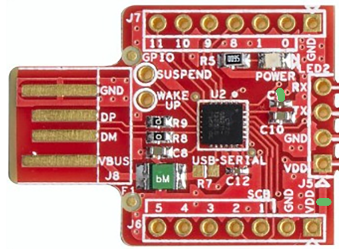
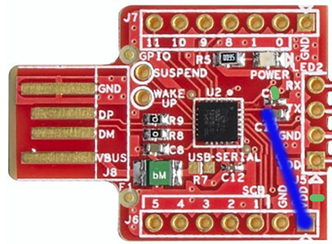
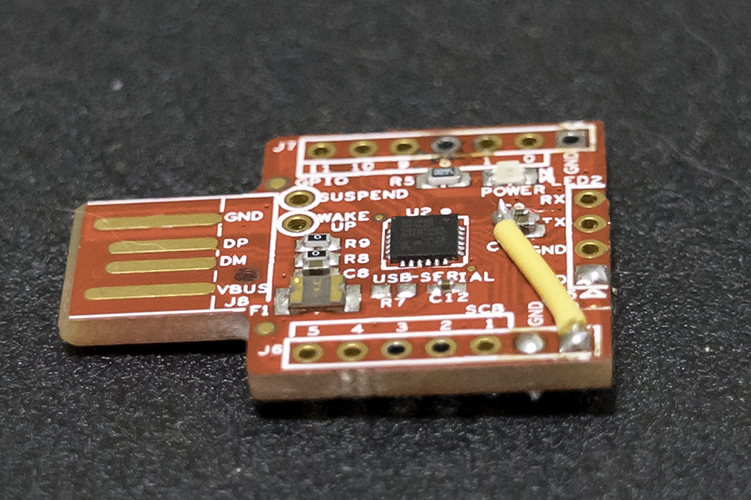
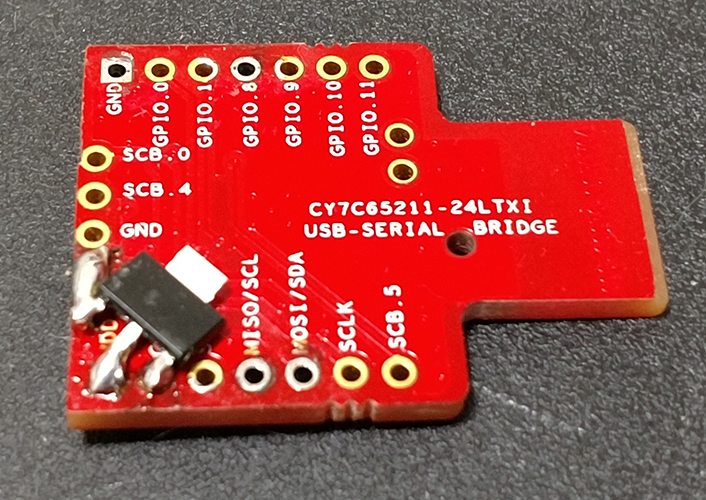
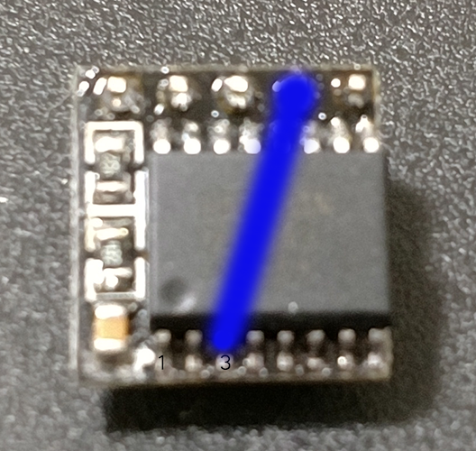

# Demonstration project for the DS3231 Real-Time Clock

## Introduction

This project is designed to demonstrate the usage of the [Maxim DS3231] RTC device with the Texas Instruments MSP430 16 bit low-power microcontroller.  Additionally, it demonstrates interaction with the i2c bus using a C-based application.

This project is configured for the [MSP430FR5994] chip, which is present on the [EXP-MSP430FR5994] Launchpad.  For ease of implementation, we recommend the use of either the "[DS3231 for Pi]", or "[Chronodot 2.0]" boards.  These breakout boards support 5V operation and feature CR1632 batteries, good for approixmately 8 years.  The DS3231 does not require an external crystal or tuning capacitors.

For reference, the [MSP430FR5994 Datasheet] contains most of the device-specific information, such as package information and specifications.  General information for the family can be found in the [Family Datasheet].

## Demonstration Firmware
This software demonstrates basic and advanced RTC functionality using the MSP430 device.  Commands are sent and data is received using RS232 - either through the backchannel UART on the Launchpad, or through the Cypress USB Bridge (on the PCB).  Available commands are in brackets, including:

* Get (or set) the current [D]ate
* Get (or set) the current [T]ime
* [S]et an alarm
* [C]lear an alarm
* S[l]eep (enter low power mode) until woken by the alarm
* Read the tem[p]erature (using the DS3231 chip)
* List [c]ommands

The demonstration firmware can be compiled using Texas Instrument's free [Code Composer Studio].  Simply load the project, compile it, and flash to the Launchpad Board.  You can program and execute the firmware from the debug menu.

## Time Application
In order to set the time, a command-line utility is included.  This application is built with the Cypress USB-Serial SDK.  The application supports properly configured Cypress USB-Serial Bridges.

## Hardware Setup
To make things easier, this demonstration uses mostly off-the-shelf hardware.  There are, however, a few modifications that need to be made.

### USB to i2c Bridge
An affordable source of (single channel) bridges is the [PSoC4 Prototyping Kit].  The USB connector and serial adapter can be snapped off and used directly.  As the MSP430 devices are 3.3v devices, it's necessary to do a little surgery if you are using the PC to set the time while the MSP430 is connected.

3.3v operation with the Cypress USB to Serial bridge requires a 3.3v reference.  As the USB bus provides only a 5v input, it's necessary to use a regulator like the [LM3940].  We will be installing one on our USB serial board.

To begin, we will need to prevent VBUS from being tied to VREF and provide an alternative VREF.  This is accomplished by carefully cutting the power trace that feeds C9 and C10.  For conveinence, we will also cut the trace that leads to VDD located opposite the USB connectors.  These cuts are indicated by the green lines below.

Next, we will connect VREF to the disconnected VDD pin, using the left side of C10 as a solder point.  This feeds VREF from the formerly VDD pin.

When you have completed this step, it will look similar to this:

On the reverse side, we will need to solder "dead bug" style (upside down), in order for the polarity to match up.  We will bridge (using solder or a piece of wire) the LM3940 supply to the VDD pin on the right side of the board.  The output from the LM3940 will connect to the VREF input on the formerly VDD pin.  The remaining pin will be connected to GND, which is found right next to the VREF output.

The result will look something like this.

We will be using GPIO 0.0 and 0.1 for activity indicators (TX and RX), and SCB pins SCL and SDA (2 and 3) as i2c Clock and Data, respectively.  Solder headers or wires as appropriate.

Note: it is possible to utilize this board in a breadboard, if a USB extension cable is used.

### DS3231 for Pi

As this board is designed for a Raspberry Pi pinout, you will need to use jumper wires to connect this board to the Launchpad.  If you are using a breadboard, I recommend either soldering male headers on, or using male to male jumper wires.  If you are connecting directly to the Launchpad, male to female jumper wires will work fine.

Unfortunately, lacks a physical connection for the Active-Low interrupt signal (required by this demonstration).  As such, we will be connecting pin to the Not Connected (NC) pin on the board.

Pin 1 is indicated by the dimple on the package.  Pin 3 is the interrupt pin - connect it to the NC pin.

## Schematic and PCB

The "board" directory contains schematics and a PCB design for an integrated module containing the MSP430 and DS3231 chips, with communication handled by the Cypress [CY7C65215] USB-Serial Dual Channel bridge, which permits access by a host PC to the MCU UART as well as the i2c bus, and takes the place of the ez-FET on the Launchpad.  Programming is performed by SWD using the [Tag-Connect] TC2030-NL footprint.  This enables easy programming of the device while requiring about the same space as an 0805 surface-mount resistor.

Recommended accessories: Texas Instruments [MSP-FET], [SPY-BI-TAG] and [TC2030-MCP-NL].

[Maxim DS3231]:           https://datasheets.maximintegrated.com/en/ds/DS3231.pdf
[MSP430FR5994]:           http://www.ti.com/product/MSP430FR5994/description
[EXP-MSP430FR5994]:       http://www.ti.com/tool/msp-exp430fr5994
[Chronodot 2.0]:          http://docs.macetech.com/doku.php/chronodot_v2.0
[DS3231 for Pi]:          http://bit.ly/2mA9jrs
[MSP430FR5994 Datasheet]: http://www.ti.com/lit/ds/symlink/msp430fr5994.pdf
[Family Datasheet]:       http://www.ti.com/lit/ug/slau367m/slau367m.pdf
[Code Composer Studio]:   http://www.ti.com/tool/CCSTUDIO

[PSoC4 Prototyping Kit]:  http://bit.ly/2neuQZW
[LM3940]:                 http://www.ti.com/lit/ds/symlink/lm3940.pdf

[CY7C65215]:              http://www.cypress.com/file/129956/download
[Tag-Connect]:            http://www.tag-connect.com
[MSP-FET]:                http://www.ti.com/tool/msp-fet
[SPY-BI-TAG]:             http://www.tag-connect.com/Materials/SPY-BI-TAG%20Datasheet.pdf
[TC2030-MCP-NL]:          http://www.tag-connect.com/Materials/TC2030-MCP-NL%20PCB%20Footprint.pdf